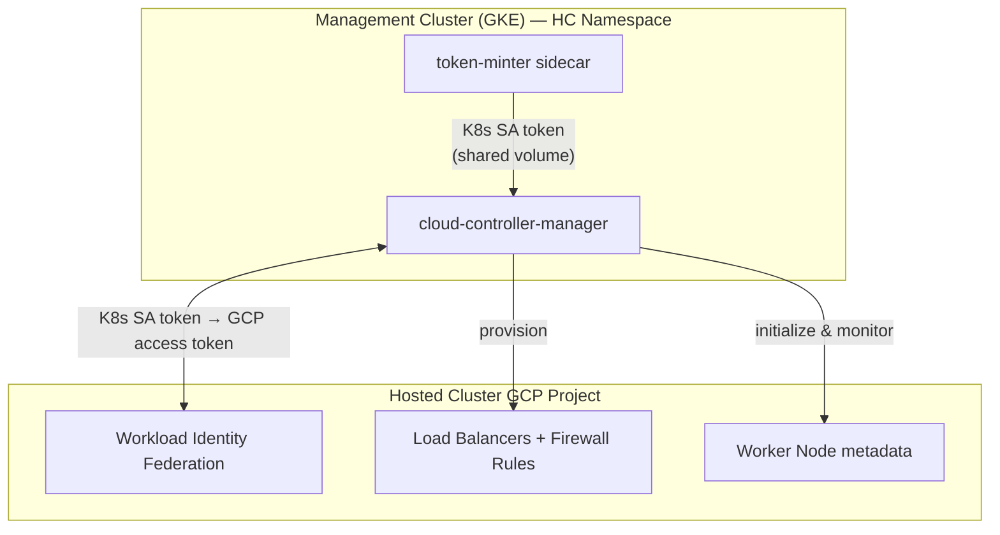

# GCP Cloud Controller Manager Demo

## Epic: [GCP-311](https://issues.redhat.com/browse/GCP-311) - Implement GCP Cloud Controller Manager for LoadBalancer and Node Management

---

## What We Built

A GCP Cloud Controller Manager (CCM) that runs inside the hosted control plane, enabling LoadBalancer service provisioning and node lifecycle management for HyperShift hosted clusters on GCP.

---

## How the CCM Fits Into the Architecture

---

## What the CCM Does

### Node Controller
- **Provider ID assignment**: Sets the GCP provider ID on each node
- **Zone labels**: Applies topology labels based on the node's GCP zone
- **Taint removal**: Clears the `node.cloudprovider.kubernetes.io/uninitialized` taint after initialization

### Service Controller
- **Load Balancer provisioning**: Creates GCP load balancers for Services of type LoadBalancer
- **Firewall rules**: Configures firewall rules to allow traffic to load-balanced services
- **External IPs**: Allocates and manages external IP addresses for load balancer frontends

> Before CCM, a temporary ProviderID Controller handled node initialization, but no component provisioned GCP Load Balancers for hosted cluster services.

---

## Authentication

- **token-minter** runs as a sidecar in the CCM deployment
- Mints tokens for the `cloud-controller-manager` ServiceAccount in the hosted cluster's `kube-system` namespace
- Tokens are exchanged for GCP credentials via **Workload Identity Federation**
- No long-lived service account keys

---

## References

- [Kubernetes Cloud Controller Manager](https://kubernetes.io/docs/concepts/architecture/cloud-controller/) - Upstream CCM architecture
- [GCP Cloud Provider](https://github.com/kubernetes/cloud-provider-gcp) - GCP CCM implementation
- [Workload Identity Federation](https://cloud.google.com/iam/docs/workload-identity-federation) - GCP WIF documentation