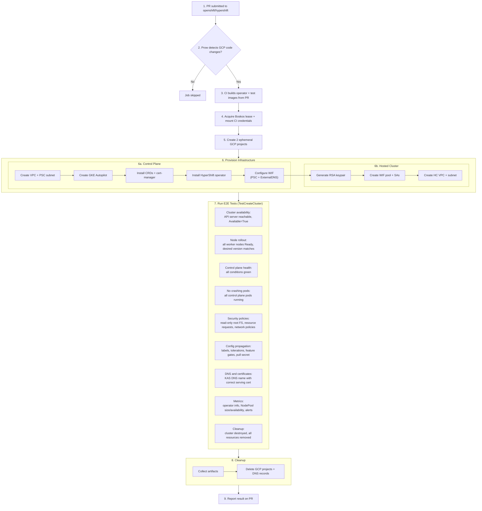

# GCP E2E CI Infrastructure Demo

## Epic: GCP-254 - GCP E2E Tests Configuration in the HyperShift Repository

---

## What We Built

Automated CI infrastructure that provisions ephemeral GCP environments, runs Hypershift GCP e2e tests, and cleans up all resources. This is the first time Hypershift GCP hosted clusters can be tested end-to-end in Prow.

---

## What Happens When a PR is Submitted

---

## Key Design Decisions

| Decision | Rationale |
|----------|-----------|
| GKE Autopilot | Managed nodes, no infra overhead, aligns with production |
| Ephemeral GCP projects | Clean isolation per test run, no resource leaks between runs |
| Two-project model | Mirrors production: CP project (management) + HC project (customer) |
| Workload Identity Federation | No long-lived SA keys for workloads; operator, ExternalDNS, and HC components authenticate via WIF |
| Cross-project DNS | CI DNS zone lives in a shared project, ExternalDNS authenticates cross-project via WIF |

---

## Security

- **CI isolation**: Service account has permissions only on the CI folder — cannot touch Integration/Production
- **Credential protection**: Prow automatically redacts secrets from logs and artifacts; scripts are designed so that credentials, tokens, and sensitive information are never exposed in CI logs
- **Ephemeral credentials**: GCP service accounts, WIF pools, and IAM bindings are created and destroyed with the ephemeral projects per test run
- **Boskos concurrency control**: 10-slot pool prevents overwhelming GCP quotas

---

---

## Known Limitations

| Issue | Workaround | Tracking |
|-------|------------|----------|
| CAPG requires v1beta1 CRDs | Pin CAPG image via HC annotation | GCP-426 |
| NodePool controller can't discover boot image from stream metadata | Hardcoded boot image in test script | GCP-440 |

---

## What's Next

- **Stabilization**: Remove `skip_report: true` to make results visible on PRs, monitor for flakes
- **Periodic job**: Add nightly scheduled runs for continuous validation
- **TestGrid/Sippy**: Configure dashboards for test result reporting and flake detection
- **Promotion path**: Informational (runs on GCP changes, non-blocking) → Blocking (required for merge)
- **Budget alerts and cost monitoring** for CI projects
- **SA key rotation strategy** for CI service account
- **V2 framework migration**: Separate cluster lifecycle (create/destroy) from test execution, enabling Ginkgo-based test suites with individual test case reporting

---

## References

- [OpenShift CI Documentation](https://docs.ci.openshift.org/)
- [Prow](https://docs.ci.openshift.org/docs/architecture/prow/) - CI/CD system that runs jobs on PRs
- [Boskos](https://docs.ci.openshift.org/docs/architecture/quota-and-leases/) - Resource leasing for concurrency control
- [Step Registry](https://steps.ci.openshift.org/) - Browse all reusable CI steps, chains, and workflows
- [CI Operator Reference](https://steps.ci.openshift.org/ci-operator-reference) - Configuration specification
- [GKE E2E Workflow](https://steps.ci.openshift.org/workflow/hypershift-gcp-gke-e2e) - This workflow in the step registry
- [Cluster Profiles](https://docs.ci.openshift.org/docs/how-tos/adding-a-cluster-profile/) - How credentials are provided to CI jobs
- [Secret Management](https://docs.ci.openshift.org/how-tos/adding-a-new-secret-to-ci/) - How secrets are stored and protected in CI